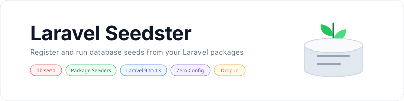

<p align="center">
    <picture>
        <source media="(prefers-color-scheme: dark)" srcset="art/banner-dark.svg">
        <source media="(prefers-color-scheme: light)" srcset="art/banner-light.svg">
        
    </picture>
</p>

<p align="center">
Let a Laravel package register its own database seeders and have them run<br>as part of the normal <code>db:seed</code> command, with no changes to the host application.
</p>

<p align="center">
    <a href="https://packagist.org/packages/jeremykenedy/laravel-seedster"></a>
    <a href="https://packagist.org/packages/jeremykenedy/laravel-seedster"></a>
    <a href="https://github.com/jeremykenedy/laravel-seedster/actions"></a>
    <a href="https://github.styleci.io/repos/1194804109?branch=main"></a>
    <a href="https://opensource.org/licenses/MIT"></a>
</p>

## Table of Contents

- [Requirements](#requirements)
- [Installation](#installation)
- [Quick Start](#quick-start)
- [How It Works](#how-it-works)
- [Artisan Commands](#artisan-commands)
- [Console Output](#console-output)
- [Translations](#translations)
- [Laravel Support](#laravel-support)
- [Upgrading](#upgrading)
- [Testing](#testing)
- [Credits](#credits)
- [License](#license)

## Requirements

- PHP 8.2 or newer
- Laravel 9 through 13

## Installation

```bash
composer require jeremykenedy/laravel-seedster
```

The service provider is auto discovered. There is nothing to register and no configuration file to publish.

## Quick Start

Register your seeders from any service provider:

```php
use Illuminate\Support\ServiceProvider;
use Mypackage\Database\Seeders\PostsTableSeeder;
use Mypackage\Database\Seeders\UsersTableSeeder;

class MypackageServiceProvider extends ServiceProvider
{
    public function register(): void
    {
        $this->app['seed.handler']->register(UsersTableSeeder::class);

        // Or register several at once.
        $this->app['seed.handler']->register([
            UsersTableSeeder::class,
            PostsTableSeeder::class,
        ]);
    }
}
```

That is the whole API. The host application keeps running `php artisan db:seed` exactly as before, and your seeders run with it.

If your package should work with or without Seedster installed, hook the binding instead of requiring it:

```php
$this->app->afterResolving('seed.handler', function ($handler): void {
    $handler->register(UsersTableSeeder::class);
});
```

The callback never fires when Seedster is absent, so the package stays installable on its own.

## How It Works

Seedster binds a `seed.handler` singleton that holds a collection of seeder class names, and replaces the framework `db:seed` command with a subclass of it.

When `db:seed` runs, the replacement resolves the root seeder the way Laravel always has, then wraps it so the registered seeders run first:

1. Every registered seeder runs, in the order it was registered.
2. The root seeder runs last. That is the `class` argument, the `--class` option, or `Database\Seeders\DatabaseSeeder` by default.

Because the command is a subclass of `Illuminate\Database\Console\Seeds\SeedCommand`, everything the framework command does still applies: the production confirmation, the `--force` bypass, unguarded models during seeding, and restoring the previous default connection after seeding a different one.

When no package has registered anything, `db:seed` behaves exactly like the framework command.

## Artisan Commands

Seedster adds no commands of its own. It extends the one Laravel already ships.

| Command | Description |
|---------|-------------|
| `db:seed` | Seed the database with records. Runs registered package seeders, then the root seeder. |

| Argument or option | Description |
|--------------------|-------------|
| `class` | The class name of the root seeder. |
| `--class` | The class name of the root seeder. Defaults to `Database\Seeders\DatabaseSeeder`. |
| `--database` | The database connection to seed. |
| `--force` | Force the operation to run when in production. |

A seeder registered by its short name resolves out of the application seeder namespace, matching how `db:seed` treats a bare class value.

## Console Output

Registered seeders report through the standard Laravel seeder output, with a line naming how many came from packages:

```
   INFO  Seeding database.

   INFO  Running 2 registered package seeders.

  Mypackage\Database\Seeders\UsersTableSeeder ................. RUNNING
  Mypackage\Database\Seeders\UsersTableSeeder ................ 4 ms DONE

  Mypackage\Database\Seeders\PostsTableSeeder ................. RUNNING
  Mypackage\Database\Seeders\PostsTableSeeder ................ 2 ms DONE
```

The root seeder reports after those, the same way it always has.

## Translations

The announcement line is translatable. Publish the language file to override it:

```bash
php artisan vendor:publish --tag=seedster-lang
```

The file lands in `lang/vendor/seedster/en/seedster.php`.

## Laravel Support

| Laravel | Supported | Built in CI |
|---------|-----------|-------------|
| 13 | Yes | Yes |
| 12 | Yes | Yes |
| 11 | Yes | No |
| 10 | Yes | No |
| 9 | Yes | No |

Laravel 9, 10 and 11 are still supported by the constraint in `composer.json`, but they are not built in CI. Every remaining release on those branches is covered by a security advisory with no patched version, so Composer will not resolve them under its default advisory policy.

## Upgrading

### From 1.0.x

Releases 1.0.0 and 1.0.1 bound the replacement command to the `command.seed` container key. Laravel stopped resolving `db:seed` through that key in Laravel 9, so on Laravel 9 and later the registered seeders were collected but never run. Upgrading fixes that, which means seeders your packages register will start running again on `db:seed`. Check what your installed packages register before seeding an environment you care about.

The public API is unchanged. The `seed.handler` binding, the `register()` and `seeders()` methods, the class names, and the `command.seed` key all behave as they did.

### From eklundkristoffer/seedster

Swap the requirement and remove the old package. The container bindings are the same, so `$this->app['seed.handler']->register(...)` keeps working untouched. The only difference is the namespace, from `Seedster\` to `Jeremykenedy\LaravelSeedster\`, which matters only if you imported the classes directly.

## Testing

```bash
composer test
```

Check code style:

```bash
composer lint
```

## Credits

- [Jeremy Kenedy](https://github.com/jeremykenedy)
- [Kristoffer Eklund](https://github.com/eklundkristoffer), author of the original [seedster](https://github.com/eklundkristoffer/seedster)

## License

The MIT License (MIT). See [LICENSE](LICENSE) for more information.
